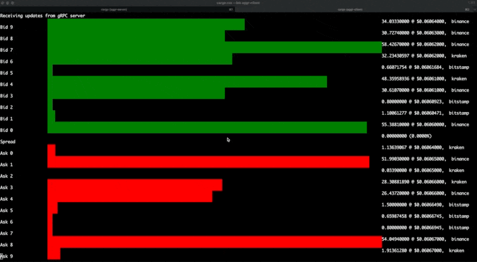

# aggr_tui

A Rust TUI client for crypto exchanges, subscribes to depth feeds of multiple exchanges,
for given pairs, and publishes orderbook as gRPC stream. The client connects to the gRPC server and
streams the orderbook summary using the Dioxus TUI library.



Exchange support:
* Bitstamp WebSocket: `wss://ws.bitstamp.net`
* Binance WebSocket: `wss://stream.binance.com:9443/ws`
* Kraken WebSocket: `wss://ws.kraken.com`
* Coinbase WebSocket: `wss://ws-feed.exchange.coinbase.com`

## Usage
```
cargo run --bin aggr-server
env RUST_LOG=info cargo run --bin aggr-server -- --symbol ETH/BTC --port 50051
cargo run --bin aggr-server -- --no-binance --no-bitstamp

cargo run --bin aggr-client
```


